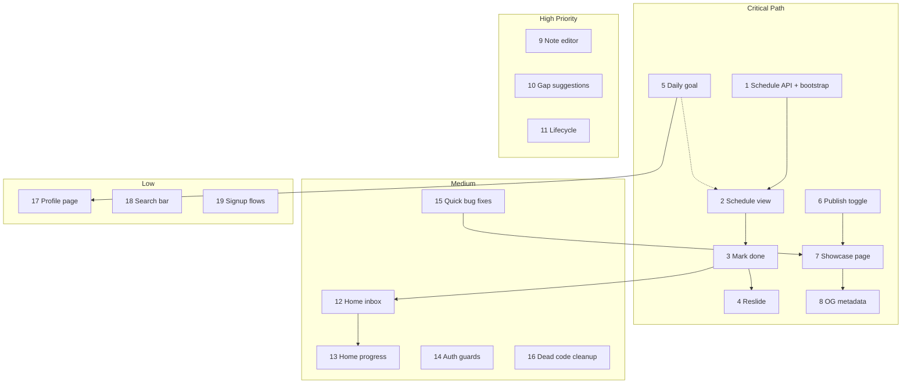

# Master To-Do List: Learning Ledger

Systematic implementation roadmap derived from the gap analysis. Each item is scoped to be implementable independently, reuses existing backend APIs where possible, and must follow the current design system (`design-system.css`, garden-vibe tokens, existing card/shell patterns).

**Rule:** Do not start the next item until the user explicitly confirms the previous one is done.

---

## Already Working (do not regress)

- Supabase auth login + JWT passthrough to backend
- Curriculum draft creation, resource dropzone, AI syllabus generation
- Resource enrichment, notes API, velocity/mastery backend
- Schedule engine, publish API, public showcase assembler (backend only)

---

## CRITICAL

### 1. Schedule API layer + bootstrap trigger after syllabus generation

**Gap:** Schedule rows are never created; frontend has no schedule API module.

**Scope:**
- Add `scheduleApi.ts` in [`apps/frontend/src/lib/`](apps/frontend/src/lib/) wrapping:
  - `POST /api/curricula/:id/schedule/bootstrap`
  - `GET /api/curricula/:id/schedule?from=&to=`
  - `POST /api/curricula/:id/schedule/reslide`
  - `PATCH /api/schedule-assignments/:id`
- After successful syllabus generation in [`WorkspacePage`](apps/frontend/src/views/WorkspacePage.tsx), call bootstrap (idempotent: handle `409 SCHEDULE_EXISTS` gracefully).
- Add TypeScript types for `ScheduleAssignment` aligned with backend response shape.

**Files likely touched:** `src/lib/scheduleApi.ts`, `src/lib/workspaceApi.ts`, `WorkspacePage.tsx`

**Acceptance:** Generating a syllabus creates schedule assignments; re-generating does not crash.

---

### 2. Daily schedule view component (Today / week list) in workspace

**Gap:** No UI to see what to do today.

**Scope:**
- New component e.g. `ScheduleCard.tsx` or `TodayPanel.tsx` under [`apps/frontend/src/components/workspace/`](apps/frontend/src/components/workspace/).
- Fetch schedule for current week via `scheduleApi`.
- Display assignments grouped by date with resource title, duration estimate, status badge (`planned` / `done` / `deferred`).
- Match existing workspace card styling (`workspace-shell`, card borders, garden palette).

**Files likely touched:** new component, `UtilityPanel.tsx` or `WorkspacePage.tsx`

**Acceptance:** User with a bootstrapped curriculum sees today's items in the workspace.

---

### 3. Mark-as-done UI wired to `PATCH /schedule-assignments/:id`

**Gap:** Backend supports completion; frontend has no interaction.

**Scope:**
- Add checkbox or "Mark complete" action per assignment in the schedule view.
- Call `PATCH /api/schedule-assignments/:id` with `{ status: "done" }`.
- Optimistic UI update + error rollback.
- Refresh velocity/mastery snapshot after completion (reuse existing `MasteryCard` refresh pattern).

**Files likely touched:** schedule component, `scheduleApi.ts`, optionally `MasteryCard.tsx`

**Acceptance:** Marking an item done persists and updates progress display.

---

### 4. Auto-reslide flow + anti-guilt messaging on missed days

**Gap:** Core "Adaptive Engine" / anti-guilt mechanism is unreachable.

**Scope:**
- On workspace load (or daily check), detect assignments onBetween `scheduled_date < today` and `status === "planned"`.
- Prompt user with garden-vibe copy (e.g. "Life happens — shift today's plan forward?") — not punitive language.
- On confirm, call `POST /api/curricula/:id/schedule/reslide` with `{ missed_date }`.
- Optionally mark overdue items as `deferred` before reslide (confirm backend behavior in [`schedulingEngine.js`](apps/backend/src/services/schedulingEngine.js) first).

**Files likely touched:** schedule component, `WorkspacePage.tsx`, `scheduleApi.ts`

**Acceptance:** Missing a day triggers a gentle reschedule; end date shifts forward.

---

### 5. Daily learning time preference (data model + settings UI)

**Gap:** MVP §C requires "I have 30 minutes a day"; no column or UI exists.

**Scope:**
- **Backend/DB:** Add `daily_minutes_goal` to `profiles` (migration) or `curricula` if per-sprint — decide during implementation (profiles = global default is simplest for MVP).
- **API:** `GET/PATCH /api/profile` or extend existing profile route if one exists.
- **UI:** Small settings panel (workspace or sidebar) — number input or preset chips (15 / 30 / 45 / 60 min).
- **Future hook:** Pass goal into schedule bootstrap logic later; for now, store and display it.

**Files likely touched:** new migration, backend profile route, `ProfileSettings.tsx`, `workspaceApi.ts` or new `profileApi.ts`

**Acceptance:** User can set and persist daily time goal; value survives reload.

---

### 6. Publish toggle + slug editor in workspace

**Gap:** Backend publish API exists; no frontend UI.

**Scope:**
- New `PublishPanel.tsx` (or section in `UtilityPanel`) using existing `GET/PUT /api/curricula/:id/publish` from [`workspaceApi.ts`](apps/frontend/src/lib/workspaceApi.ts).
- Toggle `is_published`, editable `public_slug` (validate slug format client-side).
- Show copyable public URL when published.
- Privacy-first default: unpublished until user opts in.

**Files likely touched:** new component, `UtilityPanel.tsx`, `workspaceApi.ts`

**Acceptance:** User can publish/unpublish and set slug; state persists via API.

---

### 7. Public showcase page at `/showcase/[slug]` (read-only, garden vibe)

**Gap:** Sidebar links to `/showcase` which 404s; backend `GET /public/:slug` is ready.

**Scope:**
- Create [`apps/frontend/app/showcase/[slug]/page.tsx`](apps/frontend/app/showcase/) — **no auth required**.
- Fetch from `${BACKEND_URL}/api/public/:slug` (server component or client fetch).
- Read-only layout: curriculum title, progress summary, syllabus sections, public notes (`is_public_asset`), completed items.
- Reuse design tokens; distinct "showcase" shell — polished but same garden aesthetic.
- Fix sidebar link in [`mockHome.ts`](apps/frontend/src/data/mockHome.ts) to point to user's published slug or a generic `/showcase` info state.

**Files likely touched:** new route, `showcaseApi.ts`, showcase components, `mockHome.ts`

**Acceptance:** Published slug renders a shareable read-only page; unpublished slug returns friendly 404.

---

### 8. Open Graph / social metadata for showcase sharing

**Gap:** MVP §D requires social metadata for professional sharing.

**Scope:**
- Add `generateMetadata()` in showcase page using curriculum title, overview excerpt, progress %.
- OG tags: `title`, `description`, `og:type`, `og:url`, optional `twitter:card`.
- Keep [`app/layout.tsx`](apps/frontend/app/layout.tsx) defaults for private routes.

**Files likely touched:** `app/showcase/[slug]/page.tsx`, possibly shared metadata helper

**Acceptance:** Sharing a showcase URL produces a rich link preview (verify with OG debugger).

---

## HIGH

### 9. Replace `window.prompt()` with inline Markdown note editor

**Gap:** [`NoteEditor.tsx`](apps/frontend/src/components/workspace/NoteEditor.tsx) uses native `prompt()` — unusable UX.

**Scope:**
- Replace with styled textarea + optional live preview (keep dependency-light: no heavy WYSIWYG unless needed).
- Preserve existing save flow (`POST/PATCH /api/notes`) and `is_public_asset` toggle.
- Match workspace typography and spacing from `design-system.css`.

**Files likely touched:** `NoteEditor.tsx`, possibly small `MarkdownPreview.tsx`

**Acceptance:** User can edit notes inline without browser dialogs.

---

### 10. Surface AI `gap_suggestions` with add-to-folder action

**Gap:** LLM returns 0–2 gap suggestions; stored in syllabus payload but never shown.

**Scope:**
- Read `gap_suggestions` from `latest_syllabus_version.payload` in workspace load path.
- New `GapSuggestionsCard.tsx` listing title, rationale, suggested URL/search query.
- "Add to folder" action → `POST /api/resources` + optional enrich.
- Optionally trigger `POST /api/curricula/:id/syllabus/patch` after add.

**Files likely touched:** `GapSuggestionsCard.tsx`, `UtilityPanel.tsx`, `workspaceApi.ts`

**Acceptance:** After syllabus generation, user sees AI suggestions and can act on them.

---

### 11. Curriculum lifecycle UI (activate / archive / delete)

**Gap:** Curricula stay `draft` forever; no delete.

**Scope:**
- **Backend check:** Confirm `PATCH /api/curricula/:id` exists for status updates; add if missing.
- UI: status dropdown or actions in workspace sidebar curriculum list.
- Delete with confirmation modal (cascade handled by DB FK rules).
- Filter home dashboard to prefer `active` curriculum (coordinate with item 12).

**Files likely touched:** backend route (if needed), `Sidebar.tsx`, `WorkspacePage.tsx`, `workspaceApi.ts`

**Acceptance:** User can activate, archive, and delete curricula.

---

## MEDIUM

### 12. Home dashboard — today's inbox from active schedule

**Gap:** [`BucketList`](apps/frontend/src/components/home/BucketList.tsx) shows all resources, not today's plan.

**Scope:**
- In [`homeApi.ts`](apps/frontend/src/lib/homeApi.ts), fetch active curriculum's schedule for today.
- Transform into ordered "inbox" items with resource title, time estimate, done/pending state.
- Empty state: gentle CTA to workspace if no active curriculum or no schedule.

**Files likely touched:** `homeApi.ts`, `BucketList.tsx`, `HomePage.tsx`

**Acceptance:** Home shows what to learn today, not a flat resource dump.

**Depends on:** Items 1–3 (schedule must exist and be completable).

---

### 13. Home dashboard — real progress tracks + profile display name

**Gap:** Progress ring shows 0% without schedule data; greeting hardcoded to "Serra".

**Scope:**
- Fetch profile `display_name` (requires item 5 migration/API or new profile endpoint).
- Compute progress from schedule assignments (`done / total`) for active curriculum.
- Wire [`ProgressCard`](apps/frontend/src/components/home/ProgressCard.tsx) to real completion %.

**Files likely touched:** `homeApi.ts`, `HomePage.tsx`, `ProgressCard.tsx`

**Acceptance:** Welcome message uses real name; progress ring reflects actual completion.

**Depends on:** Items 1–3, partially item 5.

---

### 14. Auth middleware, logout, and redirect unauthenticated users

**Gap:** No route protection; no logout; dead auth buttons.

**Scope:**
- Add [`middleware.ts`](apps/frontend/middleware.ts) redirecting `/home`, `/workspace` → `/` when no session cookie/token strategy allows (note: current auth uses `sessionStorage` — may need lightweight cookie mirror or client-side guard pattern; document tradeoff during implementation).
- Logout button in `Sidebar` calling `clearAccessToken()` + redirect to `/`.
- Hide or disable "Create Account" / "Forgot Password" until flows exist (item 19).

**Files likely touched:** `middleware.ts` or client auth guard, `Sidebar.tsx`, `LoginForm.tsx`

**Acceptance:** Protected routes require login; logout works.

---

### 15. Fix duplicate `GenerateStructureButton` + broken sidebar link

**Gap:** Button renders twice; `/showcase` 404s until item 7.

**Scope:**
- Remove duplicate render — keep single instance in `WorkspacePage` OR `ResourcesCard`, not both.
- Update sidebar showcase link to correct path or disable until published (temporary fix until item 7).

**Files likely touched:** `WorkspacePage.tsx`, `ResourcesCard.tsx`, `mockHome.ts`

**Acceptance:** One generate button; no broken nav links.

**Note:** Can be done early as a quick win; sidebar link fully fixed in item 7.

---

### 16. Remove dead mock code (`mockAuth`, unused mock exports)

**Gap:** Dead code adds noise and confusion.

**Scope:**
- Delete [`mockAuth.ts`](apps/frontend/src/data/mockAuth.ts) if unused.
- Remove unused exports from `mockHome.ts`, `mockWorkspace.ts` (keep types and static marketing copy).
- Verify no imports break.

**Files likely touched:** `src/data/*`

**Acceptance:** No unused mock files/exports; build passes.

---

## LOW

### 17. Profile page — view/edit `display_name`

**Gap:** Profile row created on signup but never exposed.

**Scope:**
- Simple `/settings` or profile modal.
- `GET/PATCH` profile via backend.
- Reuse form patterns from `LoginForm` / `CreateCurriculumPanel`.

**Files likely touched:** new settings page or panel, profile API

**Acceptance:** User can update display name.

**Depends on:** Item 5 (shared profile API/migration) — implement together or immediately after.

---

### 18. Wire or hide decorative search bar in Header

**Gap:** Search input in [`Header.tsx`](apps/frontend/src/components/home/Header.tsx) does nothing.

**Scope:**
- **Option A (MVP):** Hide until search is spec'd.
- **Option B:** Filter resources/notes client-side on home/workspace.

Pick during implementation based on user preference.

**Acceptance:** No misleading non-functional UI.

---

### 19. Create Account / Forgot Password flows (or hide until ready)

**Gap:** Dead buttons in `LoginForm.tsx`.

**Scope:**
- **Option A:** Supabase `signUp` + password reset email flow.
- **Option B:** Remove/hide buttons until post-MVP.

**Acceptance:** Buttons either work or are not shown.

---

## Recommended Implementation Order

**Suggested default start:** **Item 1** — it unblocks the entire Adaptive Calendar chain (2 → 3 → 4 → 12 → 13) without touching visual polish elsewhere.

**Optional early quick win:** **Item 15** — low risk, immediate UX fix, can run before item 1 if preferred.

---

## Per-Item Workflow (how we will work)

1. User names the item number to implement.
2. Agent reads relevant existing files only for that item.
3. Minimal diff; match garden-vibe design system.
4. No changes to unrelated features.
5. User confirms done → proceed to next numbered item only on explicit request.
