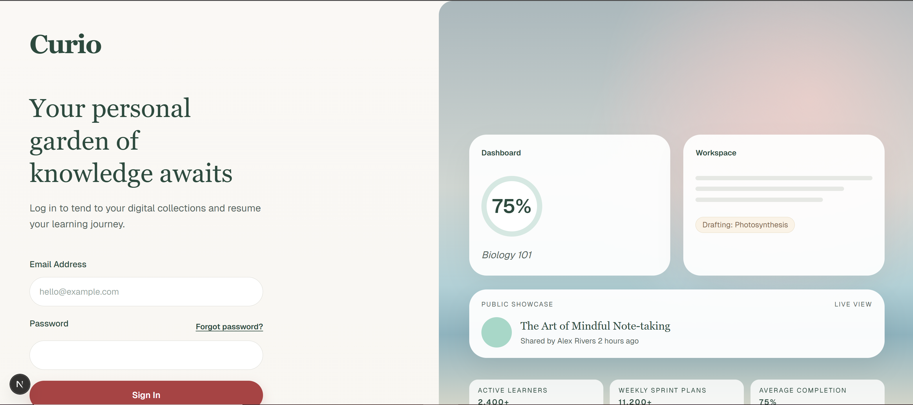
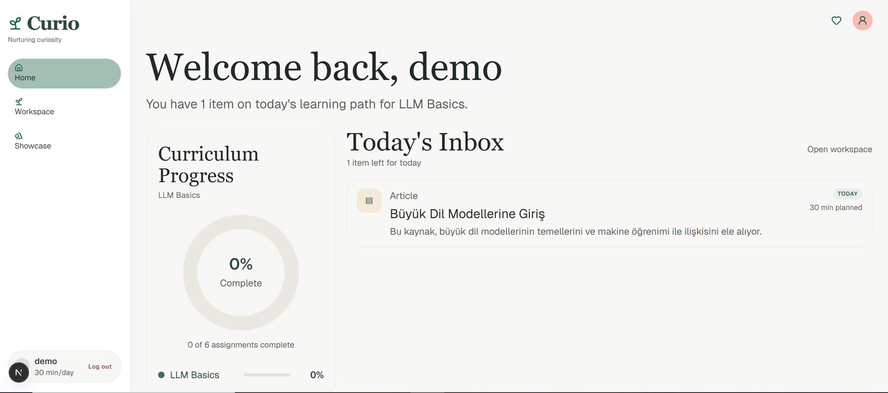
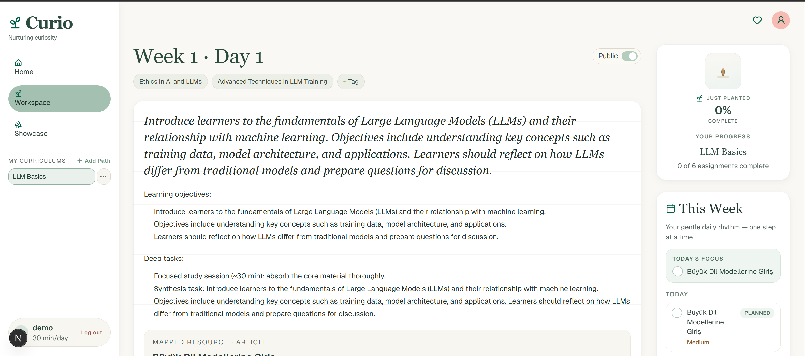

# The Adaptive Learning Ledger

Transform fragmented saved learning resources into structured, AI-sequenced monthly curriculums — and turn your progress into a shareable Proof-of-Work portfolio.

---

## Overview

**The Adaptive Learning Ledger** is a privacy-first Personal Learning Environment (PLE) that helps self-directed learners move from information hoarding to knowledge mastery. Paste URLs (YouTube, podcasts, articles, PDFs), let AI organize them into a sprint-based curriculum, track daily progress, and optionally publish a polished public showcase.

| Principle | Description |
|-----------|-------------|
| **Privacy-first** | All learning data is private by default. Public visibility is opt-in. |
| **Anti-guilt scheduling** | Miss a day? The adaptive engine slides incomplete items forward automatically. |
| **Deep Work UX** | Minimal, high-signal interface focused on progress — not social noise. |

---

## Project Structure

This repository is a **monorepo** with a separate frontend and backend service.

```
monthlycurriculum/
├── apps/
│   ├── frontend/                 # Next.js dashboard, workspace, and public showcase
│   │   ├── app/                  # App Router pages (home, workspace, showcase, settings)
│   │   ├── src/
│   │   │   ├── components/       # UI components (auth, home, workspace, landing)
│   │   │   ├── lib/              # API clients, auth, Supabase client
│   │   │   ├── views/            # Page-level view compositions
│   │   │   └── styles/           # Design system tokens
│   │   └── public/
│   │
│   └── backend/                  # Express REST API — AI, scheduling, Supabase admin
│       ├── src/
│       │   ├── config/           # Environment loading
│       │   ├── middleware/       # Auth, rate limits, error handling
│       │   ├── routes/           # REST endpoints (/api/resources, /api/curricula, …)
│       │   ├── services/         # LLM pipeline, scheduling engine, enrichment
│       │   └── lib/              # Shared utilities and Zod schemas
│       ├── test/                 # Node.js native test runner + Supertest
│       └── .env.example          # Backend environment template
│
├── supabase/
│   └── migrations/               # Versioned PostgreSQL schema (RLS policies)
│
├── prodocs/                      # Product & architecture documentation
└── screenshots/                  # UI preview images
```

---

## Tech Stack

| Layer | Technology | Version / Notes |
|-------|------------|-----------------|
| **Frontend** | Next.js (App Router) | 16.x |
| | React | 19.x |
| | TypeScript | 5.x |
| | Tailwind CSS | 4.x |
| | Icons | Lucide React |
| **Backend** | Node.js + Express | Express 5.x |
| | Validation | Zod 3.x |
| | Testing | Node.js test runner + Supertest |
| **Database & Auth** | Supabase | PostgreSQL + Row Level Security (RLS) |
| **AI** | OpenAI API | `gpt-4o-mini` (default), `gpt-4o` (optional) |
| **Deployment** | Web-first | Frontend: Vercel-compatible · Backend: standalone HTTP service |

---

## AI Features

All LLM calls run **server-side only** in `apps/backend`. Responses are validated with Zod schemas before they reach the database or frontend.

| Feature | What it does |
|---------|--------------|
| **Resource metadata enrichment** | Parses saved URLs and generates title, summary, duration, and content type via structured JSON output. |
| **Syllabus generation** | Builds a full sprint plan (7–90 days) from a folder of enriched resources — weekly distribution, sequence, and rationale per item. |
| **Cognitive load estimation** | Estimates consumption and practice minutes for each curriculum item. |
| **Gap suggestions** | Identifies missing concepts and proposes complementary search queries. |
| **Adaptive rescheduling** *(non-AI)* | When tasks slip, a deterministic scheduling engine shifts items forward — no extra LLM cost, predictable behavior. |

Supported inputs include YouTube videos, podcast links (Spotify/Apple), articles, Substack newsletters, and PDFs.

---

## Getting Started

### Prerequisites

- **Node.js** 20+
- A **Supabase** project (URL, anon key, service role key)
- An **OpenAI API key** (for enrichment and syllabus generation)

### 1. Clone and install dependencies

```bash
git clone <repository-url>
cd monthlycurriculum

# Frontend
cd apps/frontend
npm install

# Backend
cd ../backend
npm install
```

### 2. Configure environment variables

**Backend** — copy the template and fill in your values:

```bash
cd apps/backend
cp .env.example .env        # macOS / Linux
# Copy-Item .env.example .env   # Windows PowerShell
```

Required variables in `apps/backend/.env`:

| Variable | Description |
|----------|-------------|
| `PORT` | API port (default: `4000`) |
| `FRONTEND_URL` | Frontend origin for CORS (default: `http://localhost:3000`) |
| `SUPABASE_URL` | Supabase project URL |
| `SUPABASE_ANON_KEY` | Publishable anon key (user-scoped RLS) |
| `SUPABASE_SERVICE_ROLE_KEY` | Service role key (server-only admin operations) |
| `OPENAI_API_KEY` | OpenAI API key for enrichment and syllabus generation |
| `OPENAI_MODEL` | Optional — defaults to `gpt-4o-mini` |

See `apps/backend/.env.example` for the canonical template.

**Frontend** — create `apps/frontend/.env.local`:

```env
NEXT_PUBLIC_SUPABASE_URL=https://your-project-id.supabase.co
NEXT_PUBLIC_SUPABASE_ANON_KEY=your-anon-key
NEXT_PUBLIC_BACKEND_URL=http://localhost:4000
NEXT_PUBLIC_SITE_URL=http://localhost:3000
```

### 3. Apply database migrations

Run the SQL files in `supabase/migrations/` against your Supabase project (via the Supabase CLI or SQL Editor).

### 4. Start development servers

Run both services in separate terminals:

```bash
# Terminal 1 — Backend (http://localhost:4000)
cd apps/backend
npm run dev

# Terminal 2 — Frontend (http://localhost:3000)
cd apps/frontend
npm run dev
```

Open [http://localhost:3000](http://localhost:3000) in your browser.

---

## Security

> **Never commit secrets.** API keys, service role keys, and `.env` files must stay out of version control.

- The root `.gitignore` excludes `.env`, `.env.local`, and all `*.local` env variants across the monorepo.
- **OpenAI** and **Supabase service role** keys live only in `apps/backend/.env` — never in frontend code or `NEXT_PUBLIC_*` variables.
- The frontend uses the Supabase **anon key** with user JWTs; Row Level Security enforces per-user data isolation.
- All mutation endpoints require authentication (`Bearer` token) and rate limiting.

If you accidentally commit a secret, rotate the key immediately in the Supabase and OpenAI dashboards.

---

## Screenshots

### Login



### Dashboard



### Workspace & Curriculum Editor



---

## Documentation

Additional product and architecture docs live in [`prodocs/`](./prodocs/):

- [`PRD.md`](./prodocs/PRD.md) — Product requirements
- [`tech_stack.md`](./prodocs/tech_stack.md) — Architecture and AI integration details
- [`design_system.md`](./prodocs/design_system.md) — UI tokens and component guidelines

Backend auth patterns are documented in [`apps/backend/AUTH.md`](./apps/backend/AUTH.md).

---

_Developed by Serra — 2026_
